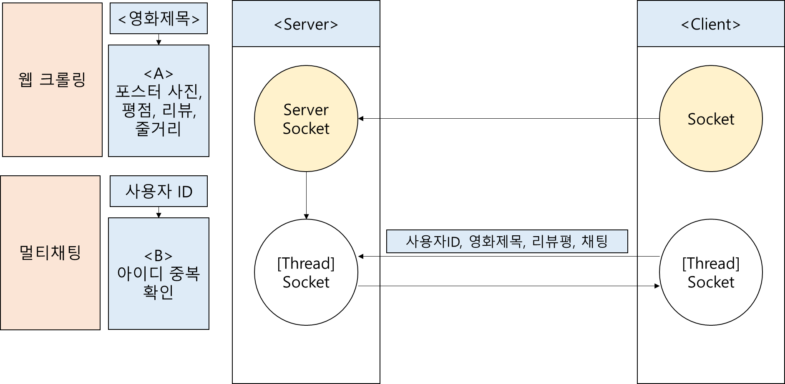

# Network Programming(Movie Review)


## 💭 Idea



# 🎸Result

|  |  |
| --- | --- |
|  |  |
|  |  |

<br>

---

<br><br>

# ✅ Architecture & Stack

Language : Java

UI : Jframe

Server & Client : JAVA / Socket Programming

<br><br>

# ✅ WebCrawling : 
  - 네이버 영화 서비스 종료

  ```java
    크롤링 코드
  ```

<br><br>

# ✅ Chat

  ```java
    채팅 코드
  ```

<br><br>

# ✅ Server & Client

  ```java
    서버 클라이언트 코드와 설명
  ```
